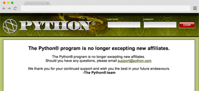
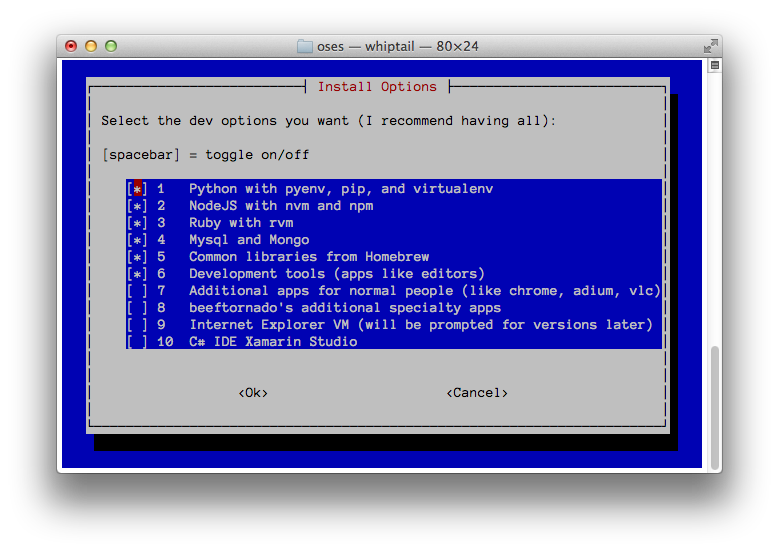

# Devstrap

## Usage

```sh
curl -s https://raw.githubusercontent.com/beeftornado/dev-strap/master/src/run.sh | bash
```

## Who wants it


* Are you a noob?
* Are you an intern?
* Did you just reformat your computer?
* Do you have multiple computers?
* Are you lazy?

If you said 'yes' to any of the above, then you might have a use for this. So please, read on.

## What does it do?

I think this is best described through example. Let's imagine for instance, scenario A, you're a noob...

### Scenario A (the noob)

Whether you're a seasoned developer or just a kid with a shiny new computer, there will be a time when you have to pick up a new language, a new framework, or a new something you aren't even sure what it is. I can't bestow that knowledge upon you, but I can ease the pain of one of the most daunting tasks that comes with picking up a new *&lt;thing-to-learn&gt;* -- getting started.

*I want to learn Python*

The first thing any good tutorial or book will instruct you to do, is **install Python**. If this is your first programming language you may be like ಠ_ಠ "wut?" So you go to http://python.com to look for python. And you find this



At this point, you go to Google&reg;, which shows a hundred seemingly good links saying to download this package and that package, pip this, pep that, setuptools this, distribute that. You are probably thinking "How can everyone say Python is easy?"

This is just one example of developer tools that aren't straight forward to setup.

Wouldn't it be easier and less intimidating to just pop open a terminal and do

```
curl -s https://raw.githubusercontent.com/beeftornado/dev-strap/master/src/run.sh | bash
```

Nothing else is required except the basic shell.

### Scenario B (the intern)

So you just showed up to work. You get a branch new computer with nothing people actually use pre-installed. Some of you probably already have a set of things you immediately install, others maybe like the vanilla a bit better. But you're about to learn a harsh truth. Your college doesn't teach you jack about the real world. How many schools expose you to developing with [NodeJS](http://nodejs.org)? Using Python virtual environments? Managing multiple versions of Ruby? Using [Mongo](http://mongodb.org) databases? Finding the system libraries that many development projects depend on (i.e. libevent)?

The usual process of getting a project to start up involves rinsing and repeating until you get it. You checkout the project, do what you can decipher out of any pre-existing readme or setup document, try to run the project, search Google for errors, fix errors, try to run again. That process continues until you finally get it to run after a very dissapointing first day of work.

The fact of the matter is, it isn't just you, it's everyone, including myself. I still check out projects that I can't boot up initially and I've recently started keeping track of things I have had to install to get it working.

### Scenario C, D, E (the lazy or migrant dev)

Even if you are familiar with what it is you have to install, it's annoying. You're at work with a desktop or stationary laptop (because you're lazy), you get everything setup just right, and then you go home to work on a different computer. I can't think of anyone who enjoys setting up a new python install that is most likely different than their system version, setting up a virtual environment with the script they have to download, then setup that environment, install some editor so they can edit their files, install node, install node modules, finding those obscure system libraries you had to install at work, and so on. Yes, the steps are easy, but there's many. Sometimes you just want to hit a button and have it all.

## Features

All features are optional installs that you pick and choose on the initial menu.

* Compatible with OSX and Linux
 * Tested on Mavericks and Ubuntu
* Installs python with pyenv, pip, and virtualenv
* Installs nodejs with nvm and npm
* Installs ruby with rvm
* Installs Mysql and Mongo client + server libraries
* Installs system libraries that are common to development projects including:
 * newt - Actually required by this project to show it's menu. It includes the `whiptail` program
 * byobu - A tmux-like terminal window manager
 * homebrew/dupes/rsync - An up-to-date `rsync` version that is better than the one bundled with osx
 * ctags - Generates tag files for source code - used if you choose to install the vim customizations
 * reattach-to-user-namespace - A program to re-enable clipboard access in `byobu`
 * git-extras - Some extra git commands
 * brew-cask - A system built on top of homebrew that can manage applications on osx
 * libevent - Provides `event.h` for event based programs, most commonly `gevent`
 * nasm - Netwide assembler, portable 80x86 assembler
 * openssl - OpenSSL command line tool
 * unixodbc - Libraries to support connections to SQLServer databases
 * wget - Non-interactive network downloader
 * yasm - Yasm modular assembler
 * glib - GNU library support building
 * libev - An event loop that is loosely modelled after libevent
 * cmake - A cross-platform make
 * autoconf - An extensible package of M4 macros that produce shell scripts to automatically configure software source code packages
 * automake - A tool for automatically generating Makefile.in files compliant with the GNU Coding Standards
 * pngquant - A command-line utility and a library for lossy compression of PNG images
* Installs applications many developers use including:
 * iterm2 - A better terminal
 * atom - A text editor from GitHub
 * brackets - A text editor from Adobe
 * pycharm - A python IDE
 * eclipse - A multipurpose IDE
 * cord - An RDP tool, alternative to Microsoft Remote Desktop
 * mysqlworkbench - Mysql's official IDE
 * sequel-pro - A different SQL IDE that supports multiple database types
 * sourcetree - An svn and git GUI
 * sqldeveloper - Oracle database GUI
 * textmate - Another popular text editor
 * virtualbox - A free virtual machine runner
 * codelite - A neat C/C++ IDE
 * wxwidgets - Libraries to support GUI design in codelite
* Installs other, non-developer applications including:
 * adium - Instant messaging application
 * hipchat - Common enterprise instant messaging client
 * transmission - Bittorrent client
 * truecrypt - Encryption software
 * google-chrome - Chrome web browser
 * vlc - Can play almost any kind of media file
 * firefox - Mozilla's web browser
 * nosleep - Can keep your mac from sleeping when the lid closes
 * gimp - A free photo editor
 * teamviewer - A remote desktop client using their own protocol
 * the-unarchiver - An archive handler that can uncompress almost any kind of archive
 * xquartz - X11 windowing system
 * cakebrew - Support installation of applications through homebrew
 * alfred - An award-winning productivity application for Mac OS X
* Installs Internet Explorer (any combination of versions) into their own virtual machine (free and legal from Microsoft)
* C# development tools - Separate because of the size of the install

## Usage

```sh
curl -s https://raw.githubusercontent.com/beeftornado/dev-strap/master/src/run.sh | bash
```

## Screenshots



## License

This project is licensed under the MIT License, which can be read [here](LICENSE)
